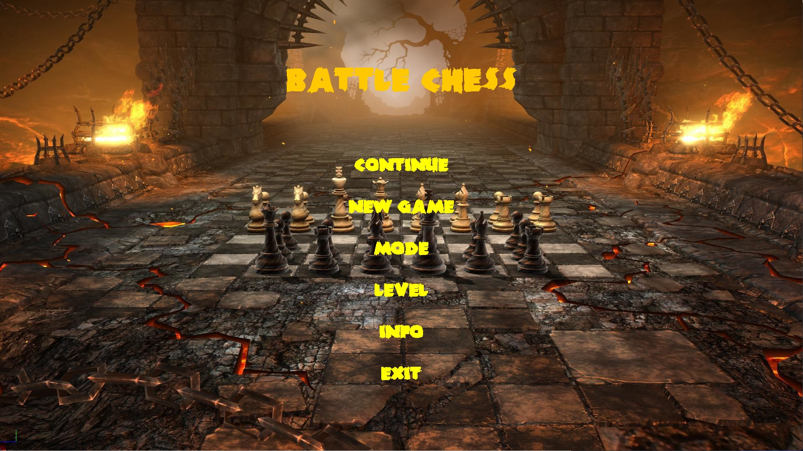

# Chess Battle
A AI chess game where a chess player can play with computer as well as with his/her friend.

## Built With
This Game is made completely in python using pygame module.
* [pygame](https://pypi.org/project/pygame/)
## Getting Started
Download the Project folder and run the main.py file
## Prerequisites
* install pygame
  ```sh
  pip install pygame
  ```
## Screenshots



## Game Menu
* ### continue - player can start his/her game from where he/she left last time
* ### new game - start new game
* ### mode - player can select the mode he/she want to play.
  * ##### There are two game modes.
  * ##### 1. play against computer
  * ##### 2. play against human
* ### level - player can select difficulty level while playing with computer
 * ##### There are three level in this game.
   * Easy
   * Medium
   * Hard
* ### info - Information about developer
* ### exit - For Quiting the Game


## Game Features
* ### Undo/Redo Feature
    This is important feature of Game. It allows player to revert his/her move. It works in both game mode (vs computer and vs human).
* ### Continue
    This feature of game allows players to continue his/her game from where he/she left the game last time.
* ### Game Mode
    There are two mode in this game.
  * #### 1. Play against Human
    A player can play chess game with his/her friend.
  * #### 2. Play against Computer
    This is the maint aspect of this Game. A player can play against computer.
* ### Game Level
    It is only applicable while playing with Computer. It has three difficulty Level
  * #### 1. Easy
    In easy level, Computer play its best move based upon 1 level of thinking.
  * #### 2. Medium
    In medium level, Computer play its best move based upon 2 level of thinking. Meaning that, it also consider the next best move of the oponent.
  * #### 3. Hard
    In hard level, Computer play its best move based upon 3 level of thinking. Meaning that it consider the next best move of the oponent as well as next best move of computer itself.

## What gives the ability to computer to think like human?
#### Ans:  [Minimax Algorithm](https://www.javatpoint.com/mini-max-algorithm-in-ai)  and alpha beta pruning. [Alpha Beta Pruning](https://www.javatpoint.com/ai-alpha-beta-pruning) algorithms.

## Mini-Max Algorithm
* Mini-max algorithm is a recursive or backtracking algorithm which is used in decision-making and game theory. It provides an optimal move for the player assuming that opponent is also playing optimally.
* Mini-Max algorithm uses recursion to search through the game-tree.
* Min-Max algorithm is mostly used for game playing in AI. Such as Chess, Checkers, tic-tac-toe, go, and various tow-players game. This Algorithm computes the minimax decision for the current state.
* In this algorithm two players play the game, one is called MAX and other is called MIN.
* Both the players fight it as the opponent player gets the minimum benefit while they get the maximum benefit.
* Both Players of the game are opponent of each other, where MAX will select the maximized value and MIN will select the minimized value.
* The minimax algorithm performs a depth-first search algorithm for the exploration of the complete game tree.
* The minimax algorithm proceeds all the way down to the terminal node of the tree, then backtrack the tree as the recursion.


## Alpha-Beta Pruning
* Alpha-beta pruning is a modified version of the minimax algorithm. It is an optimization technique for the minimax algorithm.
## Developers
* ### Chhotu Kumar ME18B045 IIT MADRAS 2021
